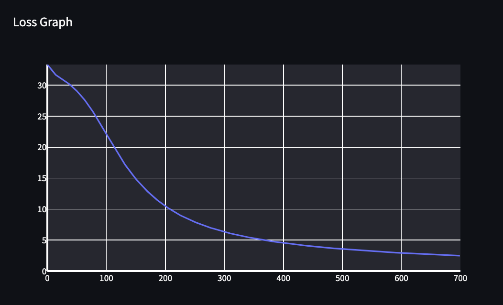
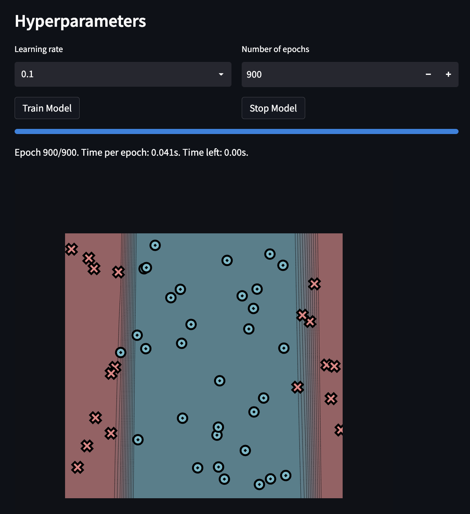

[](https://classroom.github.com/a/YFgwt0yY)
# MiniTorch Module 2


* Docs: https://minitorch.github.io/

* Overview: https://minitorch.github.io/module2/module2/

This assignment requires the following files from the previous assignments. You can get these by running

```bash
python sync_previous_module.py previous-module-dir current-module-dir
```

The files that will be synced are:

        minitorch/operators.py minitorch/module.py minitorch/autodiff.py minitorch/scalar.py minitorch/scalar_functions.py minitorch/module.py project/run_manual.py project/run_scalar.py project/datasets.py

## Task 1.5

### Simple Dataset

```bash
  PTS = 50
  HIDDEN = 2
  RATE = 0.1
  data = minitorch.datasets["Simple"](PTS)
  # Time per epoch = 0.020s
```

Log (raw numbers from terminal) of Simple Dataset: [Simple.txt](./log/Simple.txt)
<pre style="max-height: 200px; overflow-y: scroll;">
Epoch: 10/700, loss: 32.16755002628581, correct: 28, time_per_epoch: 0.017763267863880505
Epoch: 20/700, loss: 31.37875763281682, correct: 28, time_per_epoch: 0.019181569417317707
Epoch: 30/700, loss: 30.762761004244496, correct: 28, time_per_epoch: 0.019217221967635617
Epoch: 40/700, loss: 30.02728205138374, correct: 28, time_per_epoch: 0.019520288560448622
Epoch: 50/700, loss: 29.146867386865555, correct: 28, time_per_epoch: 0.01948839075425092
Epoch: 60/700, loss: 28.100857454362455, correct: 36, time_per_epoch: 0.019631506966762854
Epoch: 70/700, loss: 26.874782486634352, correct: 36, time_per_epoch: 0.019611717949450855
Epoch: 80/700, loss: 25.458791731828267, correct: 40, time_per_epoch: 0.019569741355048284
Epoch: 90/700, loss: 23.85997933583905, correct: 43, time_per_epoch: 0.019696932572584886
Epoch: 100/700, loss: 22.261670359034998, correct: 44, time_per_epoch: 0.019619929908525825
Epoch: 110/700, loss: 20.61951136695516, correct: 47, time_per_epoch: 0.01966800775613871
Epoch: 120/700, loss: 19.034466391507014, correct: 49, time_per_epoch: 0.019593626999658
Epoch: 130/700, loss: 17.54194880942952, correct: 49, time_per_epoch: 0.01962713794853851
Epoch: 140/700, loss: 16.209110067285078, correct: 49, time_per_epoch: 0.019603588902358467
Epoch: 150/700, loss: 14.98770728662206, correct: 49, time_per_epoch: 0.01965395977954991
Epoch: 160/700, loss: 13.901987789531768, correct: 49, time_per_epoch: 0.019620048333399046
Epoch: 170/700, loss: 12.920803623206483, correct: 49, time_per_epoch: 0.019649378737510992
Epoch: 180/700, loss: 12.034689595723941, correct: 49, time_per_epoch: 0.019620490996218518
Epoch: 190/700, loss: 11.24307577273972, correct: 49, time_per_epoch: 0.01958366963251723
Epoch: 200/700, loss: 10.537736136694226, correct: 49, time_per_epoch: 0.019614920687319626
Epoch: 210/700, loss: 9.90450076383503, correct: 49, time_per_epoch: 0.01958335971380297
Epoch: 220/700, loss: 9.330158413052036, correct: 49, time_per_epoch: 0.019610113687644717
Epoch: 230/700, loss: 8.819179700777546, correct: 49, time_per_epoch: 0.01958484360665986
Epoch: 240/700, loss: 8.363878797197156, correct: 49, time_per_epoch: 0.019610149731774548
Epoch: 250/700, loss: 7.950732099466269, correct: 49, time_per_epoch: 0.01959954979885147
Epoch: 260/700, loss: 7.5726054280878285, correct: 49, time_per_epoch: 0.019625398847791884
Epoch: 270/700, loss: 7.225284790975515, correct: 49, time_per_epoch: 0.019602398150961337
Epoch: 280/700, loss: 6.908208007952549, correct: 49, time_per_epoch: 0.019621597066044383
Epoch: 290/700, loss: 6.617749660064817, correct: 49, time_per_epoch: 0.019602347075734352
Epoch: 300/700, loss: 6.3504310969248285, correct: 49, time_per_epoch: 0.01961663078232065
Epoch: 310/700, loss: 6.102328197172607, correct: 49, time_per_epoch: 0.019609324035153895
Epoch: 320/700, loss: 5.874689787920073, correct: 49, time_per_epoch: 0.019628688182414877
Epoch: 330/700, loss: 5.6664161446057495, correct: 49, time_per_epoch: 0.019607917779882147
Epoch: 340/700, loss: 5.4735420569049, correct: 49, time_per_epoch: 0.019626908987498352
Epoch: 350/700, loss: 5.294460262154045, correct: 49, time_per_epoch: 0.019641358628232256
Epoch: 360/700, loss: 5.12416446955328, correct: 49, time_per_epoch: 0.019620996432951614
Epoch: 370/700, loss: 4.964956618343197, correct: 49, time_per_epoch: 0.019635854063008353
Epoch: 380/700, loss: 4.816757481097359, correct: 49, time_per_epoch: 0.01961983971082632
Epoch: 390/700, loss: 4.678953438099002, correct: 49, time_per_epoch: 0.01964060119960619
Epoch: 400/700, loss: 4.547442325102038, correct: 49, time_per_epoch: 0.01962712696960145
Epoch: 410/700, loss: 4.423812174844821, correct: 49, time_per_epoch: 0.01964303118759118
Epoch: 420/700, loss: 4.305876621638378, correct: 49, time_per_epoch: 0.01967596667962516
Epoch: 430/700, loss: 4.194690360088377, correct: 50, time_per_epoch: 0.01969297192212877
Epoch: 440/700, loss: 4.089232192460351, correct: 50, time_per_epoch: 0.01967424059671069
Epoch: 450/700, loss: 3.988286058104848, correct: 50, time_per_epoch: 0.01972876049726871
Epoch: 460/700, loss: 3.892675044266178, correct: 50, time_per_epoch: 0.019714177559875357
Epoch: 470/700, loss: 3.802390027975652, correct: 50, time_per_epoch: 0.019725050389640144
Epoch: 480/700, loss: 3.7163663494989643, correct: 50, time_per_epoch: 0.019711282793548647
Epoch: 490/700, loss: 3.6342567158511057, correct: 50, time_per_epoch: 0.0197212584392602
Epoch: 500/700, loss: 3.5557550955203654, correct: 50, time_per_epoch: 0.019712624673595924
Epoch: 510/700, loss: 3.4805900688517863, correct: 50, time_per_epoch: 0.019723856752399363
Epoch: 520/700, loss: 3.408519799557345, correct: 50, time_per_epoch: 0.01971538739561348
Epoch: 530/700, loss: 3.339327969626087, correct: 50, time_per_epoch: 0.019701623198227245
Epoch: 540/700, loss: 3.27282040749945, correct: 50, time_per_epoch: 0.01971619583101678
Epoch: 550/700, loss: 3.208822247018647, correct: 50, time_per_epoch: 0.01970451886338028
Epoch: 560/700, loss: 3.1471755106425756, correct: 50, time_per_epoch: 0.019716254742600275
Epoch: 570/700, loss: 3.087737041161794, correct: 50, time_per_epoch: 0.019703178606183643
Epoch: 580/700, loss: 3.030413723306381, correct: 50, time_per_epoch: 0.019709316670586854
Epoch: 590/700, loss: 2.9750991297119596, correct: 50, time_per_epoch: 0.019696020232844474
Epoch: 600/700, loss: 2.921671721943079, correct: 50, time_per_epoch: 0.01970531063746295
Epoch: 610/700, loss: 2.8700817105850205, correct: 50, time_per_epoch: 0.01969602455289001
Epoch: 620/700, loss: 2.8201419729857657, correct: 50, time_per_epoch: 0.019708619601484657
Epoch: 630/700, loss: 2.771765029806652, correct: 50, time_per_epoch: 0.019704934723214756
Epoch: 640/700, loss: 2.7248740353851235, correct: 50, time_per_epoch: 0.019752611422129616
Epoch: 650/700, loss: 2.679398323955853, correct: 50, time_per_epoch: 0.0197474055575885
Epoch: 660/700, loss: 2.6352707402755815, correct: 50, time_per_epoch: 0.01976015852727616
Epoch: 670/700, loss: 2.592429925346904, correct: 50, time_per_epoch: 0.019751736019833786
Epoch: 680/700, loss: 2.5508183374334568, correct: 50, time_per_epoch: 0.01976305272610702
Epoch: 690/700, loss: 2.510382304904179, correct: 50, time_per_epoch: 0.01975357135711979
Epoch: 700/700, loss: 2.471071655857451, correct: 50, time_per_epoch: 0.01976034338566104
</pre>

<div style="text-align: center;">
  
  
</div>

### Diag Dataset

```bash
  PTS = 50
  HIDDEN = 2
  RATE = 0.1
  data = minitorch.datasets["Diag"](PTS)
  # Time per epoch = 0.020s
```

Log (raw numbers from terminal) of Diag Dataset: [Diag.txt](./log/Diag.txt)
<pre style="max-height: 200px; overflow-y: scroll;">
Epoch: 10/800, loss: 33.06792192784501, correct: 44, time_per_epoch: 0.017975005236538975
Epoch: 20/800, loss: 24.879509152774503, correct: 44, time_per_epoch: 0.019724902652558825
Epoch: 30/800, loss: 20.396703457148956, correct: 44, time_per_epoch: 0.01958654772850775
Epoch: 40/800, loss: 18.41492187948022, correct: 44, time_per_epoch: 0.01994670891180271
Epoch: 50/800, loss: 17.525252563502942, correct: 44, time_per_epoch: 0.01984692554847867
Epoch: 60/800, loss: 17.014058393058214, correct: 44, time_per_epoch: 0.019954509422427318
Epoch: 70/800, loss: 16.680059705113212, correct: 44, time_per_epoch: 0.019900580527077258
Epoch: 80/800, loss: 16.374627074097173, correct: 44, time_per_epoch: 0.019848852981755764
Epoch: 90/800, loss: 16.09886439193755, correct: 44, time_per_epoch: 0.019949889445042873
Epoch: 100/800, loss: 15.860428148919073, correct: 44, time_per_epoch: 0.019869020669767173
Epoch: 110/800, loss: 15.613041907548514, correct: 44, time_per_epoch: 0.01991338772816701
Epoch: 120/800, loss: 15.35465192552383, correct: 44, time_per_epoch: 0.01988352822863366
Epoch: 130/800, loss: 15.083466882260236, correct: 44, time_per_epoch: 0.019943854281010517
Epoch: 140/800, loss: 14.797713119839859, correct: 44, time_per_epoch: 0.019918695409247216
Epoch: 150/800, loss: 14.495582011322842, correct: 44, time_per_epoch: 0.01985626504910703
Epoch: 160/800, loss: 14.175230241549368, correct: 44, time_per_epoch: 0.019901919809187422
Epoch: 170/800, loss: 13.83480786810472, correct: 44, time_per_epoch: 0.019844872212549398
Epoch: 180/800, loss: 13.483937747520821, correct: 44, time_per_epoch: 0.019868070908014287
Epoch: 190/800, loss: 13.119550810206043, correct: 44, time_per_epoch: 0.01983309416246664
Epoch: 200/800, loss: 12.734001718631479, correct: 44, time_per_epoch: 0.019847710927327473
Epoch: 210/800, loss: 12.322958850720546, correct: 44, time_per_epoch: 0.019820603149197112
Epoch: 220/800, loss: 11.885740961716001, correct: 44, time_per_epoch: 0.01978734391846808
Epoch: 230/800, loss: 11.422412576768, correct: 44, time_per_epoch: 0.019821873991004317
Epoch: 240/800, loss: 10.934079938698154, correct: 44, time_per_epoch: 0.019796045983975358
Epoch: 250/800, loss: 10.42319824130018, correct: 44, time_per_epoch: 0.01982770118105459
Epoch: 260/800, loss: 9.89382596038517, correct: 44, time_per_epoch: 0.019800544241835787
Epoch: 270/800, loss: 9.351732665800744, correct: 44, time_per_epoch: 0.019832052427904194
Epoch: 280/800, loss: 8.943498877048945, correct: 44, time_per_epoch: 0.019814654177193965
Epoch: 290/800, loss: 8.631474423487544, correct: 44, time_per_epoch: 0.01983324358963065
Epoch: 300/800, loss: 8.331243088482491, correct: 44, time_per_epoch: 0.019808724077040967
Epoch: 310/800, loss: 8.033386111074082, correct: 46, time_per_epoch: 0.01978660166455235
Epoch: 320/800, loss: 7.738222674896976, correct: 46, time_per_epoch: 0.019813270955070898
Epoch: 330/800, loss: 7.447273585207598, correct: 46, time_per_epoch: 0.019793501793437855
Epoch: 340/800, loss: 7.162146429324998, correct: 46, time_per_epoch: 0.01980973268883669
Epoch: 350/800, loss: 6.884358393930341, correct: 46, time_per_epoch: 0.019799798302501014
Epoch: 360/800, loss: 6.615269484576889, correct: 46, time_per_epoch: 0.01981008283979675
Epoch: 370/800, loss: 6.3560335176134, correct: 47, time_per_epoch: 0.019800415578878152
Epoch: 380/800, loss: 6.107563410537568, correct: 48, time_per_epoch: 0.019781326058655586
Epoch: 390/800, loss: 5.875701177107032, correct: 48, time_per_epoch: 0.019805427097603488
Epoch: 400/800, loss: 5.678834441491219, correct: 48, time_per_epoch: 0.019788328846196582
Epoch: 410/800, loss: 5.5059970833682, correct: 48, time_per_epoch: 0.01980198560840022
Epoch: 420/800, loss: 5.345857125283386, correct: 48, time_per_epoch: 0.01978619478094323
Epoch: 430/800, loss: 5.1931848904215006, correct: 48, time_per_epoch: 0.01980168913467301
Epoch: 440/800, loss: 5.051755878099169, correct: 48, time_per_epoch: 0.019793244986847685
Epoch: 450/800, loss: 4.92258236186928, correct: 48, time_per_epoch: 0.01977614658634837
Epoch: 460/800, loss: 4.8029890783545355, correct: 48, time_per_epoch: 0.01979409588133177
Epoch: 470/800, loss: 4.691139144694477, correct: 48, time_per_epoch: 0.019776044630953712
Epoch: 480/800, loss: 4.586095623548742, correct: 48, time_per_epoch: 0.019789445425021673
Epoch: 490/800, loss: 4.486433771462997, correct: 48, time_per_epoch: 0.019774562229692573
Epoch: 500/800, loss: 4.391675895756761, correct: 48, time_per_epoch: 0.01979106771731805
Epoch: 510/800, loss: 4.300739231311204, correct: 48, time_per_epoch: 0.019778970636267018
Epoch: 520/800, loss: 4.213122615446634, correct: 48, time_per_epoch: 0.019794197778097728
Epoch: 530/800, loss: 4.128648032156699, correct: 48, time_per_epoch: 0.019803900278669743
Epoch: 540/800, loss: 4.047175969724567, correct: 49, time_per_epoch: 0.019792515777616097
Epoch: 550/800, loss: 3.968574832492888, correct: 50, time_per_epoch: 0.01980835945766331
Epoch: 560/800, loss: 3.892718110834168, correct: 50, time_per_epoch: 0.019797602651803463
Epoch: 570/800, loss: 3.8194842637078583, correct: 50, time_per_epoch: 0.019814397324196303
Epoch: 580/800, loss: 3.748756748845862, correct: 50, time_per_epoch: 0.019801476736282114
Epoch: 590/800, loss: 3.6804240013111063, correct: 50, time_per_epoch: 0.019813651764251657
Epoch: 600/800, loss: 3.614379368373946, correct: 50, time_per_epoch: 0.01980377394030376
Epoch: 610/800, loss: 3.550521013861871, correct: 50, time_per_epoch: 0.019793851090726212
Epoch: 620/800, loss: 3.4887518000504305, correct: 50, time_per_epoch: 0.019805107715625117
Epoch: 630/800, loss: 3.428979152568693, correct: 50, time_per_epoch: 0.019796578139775152
Epoch: 640/800, loss: 3.371114912569948, correct: 50, time_per_epoch: 0.019800500453169372
Epoch: 650/800, loss: 3.315075179694221, correct: 50, time_per_epoch: 0.01980153023738832
Epoch: 660/800, loss: 3.2607801488079535, correct: 50, time_per_epoch: 0.01979292755588641
Epoch: 670/800, loss: 3.20815394304893, correct: 50, time_per_epoch: 0.01980670482675294
Epoch: 680/800, loss: 3.1571244453025726, correct: 50, time_per_epoch: 0.019796852848428286
Epoch: 690/800, loss: 3.1076231298790673, correct: 50, time_per_epoch: 0.019809804673477812
Epoch: 700/800, loss: 3.0595848958460596, correct: 50, time_per_epoch: 0.01980118268566703
Epoch: 710/800, loss: 3.012947903195439, correct: 50, time_per_epoch: 0.019811607446683945
Epoch: 720/800, loss: 2.9676534127824787, correct: 50, time_per_epoch: 0.019831659063056173
Epoch: 730/800, loss: 2.923645630767842, correct: 50, time_per_epoch: 0.019821518260053017
Epoch: 740/800, loss: 2.8808715581151936, correct: 50, time_per_epoch: 0.0198339527917777
Epoch: 750/800, loss: 2.8392808455456033, correct: 50, time_per_epoch: 0.019824950577574628
Epoch: 760/800, loss: 2.7988256542224277, correct: 50, time_per_epoch: 0.019838302426833203
Epoch: 770/800, loss: 2.759460522333348, correct: 50, time_per_epoch: 0.019831088111867547
Epoch: 780/800, loss: 2.7211422376477836, correct: 50, time_per_epoch: 0.019841526290366042
Epoch: 790/800, loss: 2.6838297160551785, correct: 50, time_per_epoch: 0.019834107605154083
Epoch: 800/800, loss: 2.6474838860307357, correct: 50, time_per_epoch: 0.019824204819925716
</pre>

<div style="text-align: center;">
  
  
</div>

### Split Dataset

```bash
  PTS = 50
  HIDDEN = 4
  RATE = 0.1
  data = minitorch.datasets["Split"](PTS)
  # Time per epoch = 0.041s
```

Log (raw numbers from terminal) of Split Dataset: [Split.txt](./log/Split.txt)
<pre style="max-height: 200px; overflow-y: scroll;">
Epoch: 10/900, loss: 32.5042715227596, correct: 32, time_per_epoch: 0.036645910956642845
Epoch: 20/900, loss: 32.20410488829412, correct: 32, time_per_epoch: 0.03897834959484282
Epoch: 30/900, loss: 32.04688725595712, correct: 32, time_per_epoch: 0.039629197889758695
Epoch: 40/900, loss: 31.886413283056754, correct: 32, time_per_epoch: 0.03999910122010766
Epoch: 50/900, loss: 31.721418821217714, correct: 32, time_per_epoch: 0.04056952981387868
Epoch: 60/900, loss: 31.54473713656062, correct: 32, time_per_epoch: 0.04058277020688917
Epoch: 70/900, loss: 31.35268314034295, correct: 32, time_per_epoch: 0.0405877476007166
Epoch: 80/900, loss: 31.142658673199985, correct: 32, time_per_epoch: 0.04061554390707134
Epoch: 90/900, loss: 30.911579379417745, correct: 32, time_per_epoch: 0.04075447543636783
Epoch: 100/900, loss: 30.66220601368565, correct: 32, time_per_epoch: 0.040910614599095715
Epoch: 110/900, loss: 30.394099399582668, correct: 32, time_per_epoch: 0.04088336283022219
Epoch: 120/900, loss: 30.101814598114817, correct: 32, time_per_epoch: 0.04084513207112462
Epoch: 130/900, loss: 29.78491925714444, correct: 32, time_per_epoch: 0.040824154861100755
Epoch: 140/900, loss: 29.44170738988813, correct: 32, time_per_epoch: 0.04079046824299697
Epoch: 150/900, loss: 29.07152425716896, correct: 32, time_per_epoch: 0.04088121849969523
Epoch: 160/900, loss: 28.676416707005007, correct: 32, time_per_epoch: 0.04085948452446031
Epoch: 170/900, loss: 28.252812520092814, correct: 33, time_per_epoch: 0.040857497711627805
Epoch: 180/900, loss: 27.800558163396307, correct: 35, time_per_epoch: 0.04081597249152252
Epoch: 190/900, loss: 27.316863887380936, correct: 37, time_per_epoch: 0.040791727485457015
Epoch: 200/900, loss: 26.791701594244135, correct: 38, time_per_epoch: 0.04077198019075157
Epoch: 210/900, loss: 26.230832513050693, correct: 38, time_per_epoch: 0.04083957830311563
Epoch: 220/900, loss: 25.6252874558497, correct: 38, time_per_epoch: 0.04083510977110712
Epoch: 230/900, loss: 24.97305792651299, correct: 38, time_per_epoch: 0.040819979333258295
Epoch: 240/900, loss: 24.275902008977177, correct: 40, time_per_epoch: 0.04080593833290195
Epoch: 250/900, loss: 23.53753024977832, correct: 40, time_per_epoch: 0.04081043114225228
Epoch: 260/900, loss: 22.76327817792969, correct: 41, time_per_epoch: 0.0407930882041025
Epoch: 270/900, loss: 21.97627580725192, correct: 42, time_per_epoch: 0.040781831389423664
Epoch: 280/900, loss: 21.175893523218075, correct: 42, time_per_epoch: 0.040832662921783336
Epoch: 290/900, loss: 20.361624837809146, correct: 43, time_per_epoch: 0.04081858474364396
Epoch: 300/900, loss: 19.539164108838676, correct: 44, time_per_epoch: 0.04080948243505535
Epoch: 310/900, loss: 18.716267769688322, correct: 44, time_per_epoch: 0.04079335448826241
Epoch: 320/900, loss: 17.900374058717915, correct: 44, time_per_epoch: 0.04077516835055247
Epoch: 330/900, loss: 17.098330476563774, correct: 45, time_per_epoch: 0.040762671531147106
Epoch: 340/900, loss: 16.322930495141943, correct: 45, time_per_epoch: 0.04075606827162578
Epoch: 350/900, loss: 15.573506549709688, correct: 47, time_per_epoch: 0.04074455054736885
Epoch: 360/900, loss: 14.853386463618437, correct: 47, time_per_epoch: 0.04078402281467934
Epoch: 370/900, loss: 14.16382890697744, correct: 47, time_per_epoch: 0.04078569052354345
Epoch: 380/900, loss: 13.512394578238453, correct: 48, time_per_epoch: 0.04077708189255922
Epoch: 390/900, loss: 12.897267367007546, correct: 48, time_per_epoch: 0.04077636860215755
Epoch: 400/900, loss: 12.323315702862619, correct: 48, time_per_epoch: 0.04076401253888137
Epoch: 410/900, loss: 11.786474985739597, correct: 48, time_per_epoch: 0.04075518547763499
Epoch: 420/900, loss: 11.284507471198111, correct: 48, time_per_epoch: 0.04075056809993934
Epoch: 430/900, loss: 10.816256682520772, correct: 48, time_per_epoch: 0.04078425995988248
Epoch: 440/900, loss: 10.381437761589215, correct: 48, time_per_epoch: 0.040775374220071735
Epoch: 450/900, loss: 9.978002581022311, correct: 48, time_per_epoch: 0.04076725944975792
Epoch: 460/900, loss: 9.600004115305287, correct: 48, time_per_epoch: 0.04075907161075484
Epoch: 470/900, loss: 9.24743143199826, correct: 48, time_per_epoch: 0.04075553564002812
Epoch: 480/900, loss: 8.918396545577947, correct: 48, time_per_epoch: 0.04075189043231417
Epoch: 490/900, loss: 8.610123718305982, correct: 49, time_per_epoch: 0.040752605119693544
Epoch: 500/900, loss: 8.320846049465514, correct: 49, time_per_epoch: 0.04074738506309525
Epoch: 510/900, loss: 8.049665203406978, correct: 49, time_per_epoch: 0.0407695560306019
Epoch: 520/900, loss: 7.7953323706262045, correct: 49, time_per_epoch: 0.040759391839582035
Epoch: 530/900, loss: 7.55666214938495, correct: 49, time_per_epoch: 0.04075031316437515
Epoch: 540/900, loss: 7.332949567254547, correct: 49, time_per_epoch: 0.04074872311294189
Epoch: 550/900, loss: 7.123170612042607, correct: 49, time_per_epoch: 0.040744196481583554
Epoch: 560/900, loss: 6.925847249797778, correct: 49, time_per_epoch: 0.04076878654765573
Epoch: 570/900, loss: 6.739896697517287, correct: 49, time_per_epoch: 0.04076097224514455
Epoch: 580/900, loss: 6.564244727154537, correct: 49, time_per_epoch: 0.040755461497479176
Epoch: 590/900, loss: 6.398580924675815, correct: 49, time_per_epoch: 0.0407486365329594
Epoch: 600/900, loss: 6.242306399235809, correct: 49, time_per_epoch: 0.04073837791227065
Epoch: 610/900, loss: 6.094489796439, correct: 49, time_per_epoch: 0.040729337355118925
Epoch: 620/900, loss: 5.954451279564801, correct: 49, time_per_epoch: 0.04072823539832172
Epoch: 630/900, loss: 5.821694031231136, correct: 49, time_per_epoch: 0.0407173059254932
Epoch: 640/900, loss: 5.695715217954935, correct: 49, time_per_epoch: 0.04072759601515653
Epoch: 650/900, loss: 5.575990695388694, correct: 49, time_per_epoch: 0.040752012425670246
Epoch: 660/900, loss: 5.4620221427390385, correct: 49, time_per_epoch: 0.0407496418426329
Epoch: 670/900, loss: 5.353627658452746, correct: 49, time_per_epoch: 0.0407448141834242
Epoch: 680/900, loss: 5.250732496289486, correct: 49, time_per_epoch: 0.04073575344729879
Epoch: 690/900, loss: 5.15253641731755, correct: 49, time_per_epoch: 0.0407331593647362
Epoch: 700/900, loss: 5.058727325608497, correct: 49, time_per_epoch: 0.040730635211743235
Epoch: 710/900, loss: 4.969018740118484, correct: 49, time_per_epoch: 0.04072518724261792
Epoch: 720/900, loss: 4.883146720942259, correct: 49, time_per_epoch: 0.040743059986342006
Epoch: 730/900, loss: 4.801159024276875, correct: 49, time_per_epoch: 0.04073947920844917
Epoch: 740/900, loss: 4.722521520640423, correct: 49, time_per_epoch: 0.04074910842133598
Epoch: 750/900, loss: 4.647004500919842, correct: 49, time_per_epoch: 0.040743275742714954
Epoch: 760/900, loss: 4.574323260041442, correct: 49, time_per_epoch: 0.04073729464948256
Epoch: 770/900, loss: 4.504230490458087, correct: 49, time_per_epoch: 0.04073639818975743
Epoch: 780/900, loss: 4.436770028131319, correct: 49, time_per_epoch: 0.04075988001463202
Epoch: 790/900, loss: 4.371788839946036, correct: 49, time_per_epoch: 0.04075916708646019
Epoch: 800/900, loss: 4.309143201578841, correct: 49, time_per_epoch: 0.040761341018772004
Epoch: 810/900, loss: 4.248711253155222, correct: 49, time_per_epoch: 0.04076080051803119
Epoch: 820/900, loss: 4.190366039794704, correct: 49, time_per_epoch: 0.04075577343279784
Epoch: 830/900, loss: 4.133984966522767, correct: 49, time_per_epoch: 0.04075122883747344
Epoch: 840/900, loss: 4.079866937492824, correct: 49, time_per_epoch: 0.04075056732622253
Epoch: 850/900, loss: 4.023952919839435, correct: 49, time_per_epoch: 0.040750605239150944
Epoch: 860/900, loss: 3.967725914096353, correct: 49, time_per_epoch: 0.04076609655816658
Epoch: 870/900, loss: 3.896466217184523, correct: 49, time_per_epoch: 0.04076351801919335
Epoch: 880/900, loss: 3.8380816851182686, correct: 49, time_per_epoch: 0.04076237007383591
Epoch: 890/900, loss: 3.7916716211138097, correct: 49, time_per_epoch: 0.040760387341449024
Epoch: 900/900, loss: 3.746689779179736, correct: 49, time_per_epoch: 0.04076084021590526
</pre>

<div style="text-align: center;">
  
  
</div>

### Xor Dataset

```bash
  PTS = 60
  HIDDEN = 6
  RATE = 0.1
  data = minitorch.datasets["Xor"](PTS)
  # Time per epoch = 0.083s
```

Log (raw numbers from terminal) of Xor Dataset: [Xor.txt](./log/Xor.txt)
<pre style="max-height: 200px; overflow-y: scroll;">
Epoch: 10/1000, loss: 40.13245697545383, correct: 37, time_per_epoch: 0.0695991732857444
Epoch: 20/1000, loss: 39.22284579942533, correct: 37, time_per_epoch: 0.07706005232674736
Epoch: 30/1000, loss: 38.47583114351825, correct: 37, time_per_epoch: 0.07939322533146027
Epoch: 40/1000, loss: 37.82244547107029, correct: 37, time_per_epoch: 0.0801351942667147
Epoch: 50/1000, loss: 37.211629980576895, correct: 38, time_per_epoch: 0.08127260675617293
Epoch: 60/1000, loss: 36.68682408525086, correct: 38, time_per_epoch: 0.08198901473498735
Epoch: 70/1000, loss: 36.14727399918945, correct: 41, time_per_epoch: 0.08210782937600579
Epoch: 80/1000, loss: 35.63271470304518, correct: 41, time_per_epoch: 0.08255627125869562
Epoch: 90/1000, loss: 35.11955716396026, correct: 41, time_per_epoch: 0.0826569337111253
Epoch: 100/1000, loss: 34.61182400703072, correct: 42, time_per_epoch: 0.08307389221569099
Epoch: 110/1000, loss: 34.12845064437316, correct: 42, time_per_epoch: 0.08319603645049774
Epoch: 120/1000, loss: 33.654488541674326, correct: 42, time_per_epoch: 0.08338448823976123
Epoch: 130/1000, loss: 33.179795601346875, correct: 42, time_per_epoch: 0.08354251803332613
Epoch: 140/1000, loss: 32.709831291524296, correct: 42, time_per_epoch: 0.08347958199521328
Epoch: 150/1000, loss: 32.26323961493077, correct: 42, time_per_epoch: 0.08366147729734712
Epoch: 160/1000, loss: 31.8362351417468, correct: 43, time_per_epoch: 0.08363958471310065
Epoch: 170/1000, loss: 31.442231397310422, correct: 43, time_per_epoch: 0.08366456645274023
Epoch: 180/1000, loss: 31.06112175654821, correct: 43, time_per_epoch: 0.08370650802528001
Epoch: 190/1000, loss: 30.680980587631538, correct: 43, time_per_epoch: 0.0837444397791518
Epoch: 200/1000, loss: 30.30057163790141, correct: 43, time_per_epoch: 0.08374038264526064
Epoch: 210/1000, loss: 29.92163197515178, correct: 43, time_per_epoch: 0.08375622310909615
Epoch: 220/1000, loss: 29.552434499323724, correct: 44, time_per_epoch: 0.08366700858551993
Epoch: 230/1000, loss: 29.178345552468482, correct: 44, time_per_epoch: 0.08371208653305516
Epoch: 240/1000, loss: 28.79476658952238, correct: 44, time_per_epoch: 0.08361185437910784
Epoch: 250/1000, loss: 28.401994727785883, correct: 44, time_per_epoch: 0.08361121097883856
Epoch: 260/1000, loss: 27.99969556950185, correct: 45, time_per_epoch: 0.08356673142005658
Epoch: 270/1000, loss: 27.586533717439167, correct: 45, time_per_epoch: 0.08356113979297371
Epoch: 280/1000, loss: 27.16490816766378, correct: 46, time_per_epoch: 0.08354903964385443
Epoch: 290/1000, loss: 26.731196113371325, correct: 47, time_per_epoch: 0.08359490719038187
Epoch: 300/1000, loss: 26.282781569578237, correct: 48, time_per_epoch: 0.08357495326932482
Epoch: 310/1000, loss: 25.816909723502427, correct: 48, time_per_epoch: 0.083571733002494
Epoch: 320/1000, loss: 25.358635247497038, correct: 48, time_per_epoch: 0.08355500245020026
Epoch: 330/1000, loss: 24.949982833397424, correct: 48, time_per_epoch: 0.08355654402441849
Epoch: 340/1000, loss: 24.576889601234633, correct: 48, time_per_epoch: 0.08351683267050825
Epoch: 350/1000, loss: 24.21861219206779, correct: 48, time_per_epoch: 0.08351732998492031
Epoch: 360/1000, loss: 23.85968968918924, correct: 48, time_per_epoch: 0.08353393031619592
Epoch: 370/1000, loss: 23.49090277547471, correct: 48, time_per_epoch: 0.08350619987014811
Epoch: 380/1000, loss: 23.129576492499286, correct: 49, time_per_epoch: 0.08353327077830558
Epoch: 390/1000, loss: 22.74636102678436, correct: 49, time_per_epoch: 0.08348641188248344
Epoch: 400/1000, loss: 22.380199304269397, correct: 49, time_per_epoch: 0.08351747115651272
Epoch: 410/1000, loss: 22.034997552989452, correct: 49, time_per_epoch: 0.08347651790238354
Epoch: 420/1000, loss: 21.698270055449477, correct: 50, time_per_epoch: 0.08350526068952474
Epoch: 430/1000, loss: 21.362113499918177, correct: 51, time_per_epoch: 0.08349444528743452
Epoch: 440/1000, loss: 21.02456809819927, correct: 52, time_per_epoch: 0.08353849657538796
Epoch: 450/1000, loss: 20.673675350669548, correct: 52, time_per_epoch: 0.08351324825752073
Epoch: 460/1000, loss: 20.317510437859383, correct: 53, time_per_epoch: 0.08353674851374099
Epoch: 470/1000, loss: 19.958186975654403, correct: 54, time_per_epoch: 0.08353286791758932
Epoch: 480/1000, loss: 19.600346905855382, correct: 54, time_per_epoch: 0.08354906629376005
Epoch: 490/1000, loss: 19.216578187977596, correct: 56, time_per_epoch: 0.08353189586864712
Epoch: 500/1000, loss: 18.839538983451025, correct: 56, time_per_epoch: 0.08353627941565599
Epoch: 510/1000, loss: 18.471408443744004, correct: 56, time_per_epoch: 0.08351986702174356
Epoch: 520/1000, loss: 18.108529122539526, correct: 56, time_per_epoch: 0.08352774255792834
Epoch: 530/1000, loss: 17.75398721753435, correct: 56, time_per_epoch: 0.08350585499276773
Epoch: 540/1000, loss: 17.406190546184853, correct: 56, time_per_epoch: 0.08352453959847554
Epoch: 550/1000, loss: 17.070673052710163, correct: 57, time_per_epoch: 0.08351441909526956
Epoch: 560/1000, loss: 16.732338033871162, correct: 57, time_per_epoch: 0.08354054882777141
Epoch: 570/1000, loss: 16.39869432402198, correct: 57, time_per_epoch: 0.08356648861004884
Epoch: 580/1000, loss: 16.068579627626818, correct: 57, time_per_epoch: 0.0835649068507393
Epoch: 590/1000, loss: 15.74342620925084, correct: 58, time_per_epoch: 0.08356354482686257
Epoch: 600/1000, loss: 15.425055022495659, correct: 58, time_per_epoch: 0.08354729265222534
Epoch: 610/1000, loss: 15.120493925222899, correct: 58, time_per_epoch: 0.08356539083190519
Epoch: 620/1000, loss: 14.827311498159352, correct: 58, time_per_epoch: 0.08355897713014661
Epoch: 630/1000, loss: 14.54179464263875, correct: 58, time_per_epoch: 0.08357679560520759
Epoch: 640/1000, loss: 14.271727722733116, correct: 58, time_per_epoch: 0.0835579654169901
Epoch: 650/1000, loss: 14.015434421311195, correct: 58, time_per_epoch: 0.0835701965150379
Epoch: 660/1000, loss: 13.768009792616027, correct: 58, time_per_epoch: 0.08355132822911066
Epoch: 670/1000, loss: 13.528664781681186, correct: 58, time_per_epoch: 0.08354856644586373
Epoch: 680/1000, loss: 13.294035835930295, correct: 58, time_per_epoch: 0.08352546719902587
Epoch: 690/1000, loss: 13.066776437617376, correct: 58, time_per_epoch: 0.08353201283732302
Epoch: 700/1000, loss: 12.84440546021003, correct: 58, time_per_epoch: 0.08351561040238885
Epoch: 710/1000, loss: 12.62793114430546, correct: 58, time_per_epoch: 0.08351878476042285
Epoch: 720/1000, loss: 12.417100299017104, correct: 58, time_per_epoch: 0.08348879337972147
Epoch: 730/1000, loss: 12.21184951850937, correct: 58, time_per_epoch: 0.08347233082135953
Epoch: 740/1000, loss: 12.013809191031532, correct: 58, time_per_epoch: 0.0834447558913958
Epoch: 750/1000, loss: 11.820992781414475, correct: 58, time_per_epoch: 0.0834254434359534
Epoch: 760/1000, loss: 11.637572613543472, correct: 58, time_per_epoch: 0.08342845054556286
Epoch: 770/1000, loss: 11.461892609569901, correct: 58, time_per_epoch: 0.08340176132093298
Epoch: 780/1000, loss: 11.286497522737704, correct: 58, time_per_epoch: 0.08337860803445384
Epoch: 790/1000, loss: 11.117164666415768, correct: 58, time_per_epoch: 0.08336358757597759
Epoch: 800/1000, loss: 10.952015446891927, correct: 58, time_per_epoch: 0.08334393507234761
Epoch: 810/1000, loss: 10.795005965921966, correct: 58, time_per_epoch: 0.08336069757341603
Epoch: 820/1000, loss: 10.632699055341782, correct: 58, time_per_epoch: 0.08334616679657392
Epoch: 830/1000, loss: 10.482358783606903, correct: 58, time_per_epoch: 0.08333681206410543
Epoch: 840/1000, loss: 10.329235045451817, correct: 58, time_per_epoch: 0.08332387644102117
Epoch: 850/1000, loss: 10.184844730571465, correct: 58, time_per_epoch: 0.0833267568841524
Epoch: 860/1000, loss: 10.03991914403037, correct: 58, time_per_epoch: 0.08330716710195862
Epoch: 870/1000, loss: 9.900503521184293, correct: 58, time_per_epoch: 0.08329136856114139
Epoch: 880/1000, loss: 9.766469570846876, correct: 58, time_per_epoch: 0.08327858916205796
Epoch: 890/1000, loss: 9.633405050575238, correct: 58, time_per_epoch: 0.08325993947843643
Epoch: 900/1000, loss: 9.504275282714174, correct: 58, time_per_epoch: 0.08325944941792715
Epoch: 910/1000, loss: 9.382156649619864, correct: 58, time_per_epoch: 0.08324748284206955
Epoch: 920/1000, loss: 9.265049389354012, correct: 59, time_per_epoch: 0.0832473027977959
Epoch: 930/1000, loss: 9.140292306197736, correct: 59, time_per_epoch: 0.08324161866553743
Epoch: 940/1000, loss: 9.016423768320243, correct: 59, time_per_epoch: 0.08322724095059758
Epoch: 950/1000, loss: 8.911632410844563, correct: 59, time_per_epoch: 0.08323247625750071
Epoch: 960/1000, loss: 8.788507666117113, correct: 59, time_per_epoch: 0.08321627245733319
Epoch: 970/1000, loss: 8.686115771068849, correct: 59, time_per_epoch: 0.0832079505331116
Epoch: 980/1000, loss: 8.570863767803676, correct: 59, time_per_epoch: 0.08320514871439802
Epoch: 990/1000, loss: 8.466675687315306, correct: 59, time_per_epoch: 0.08321366083970826
Epoch: 1000/1000, loss: 8.370576622281444, correct: 59, time_per_epoch: 0.08319772730816852
</pre>

<div style="text-align: center;">
  
  
</div>